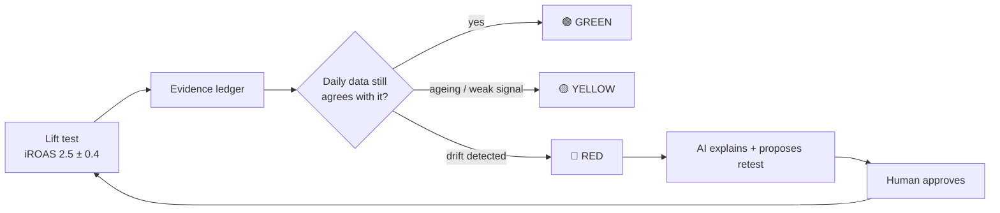
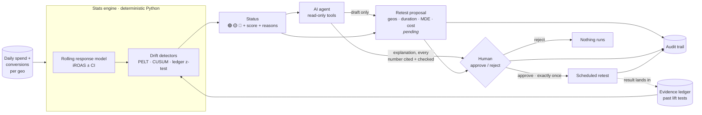
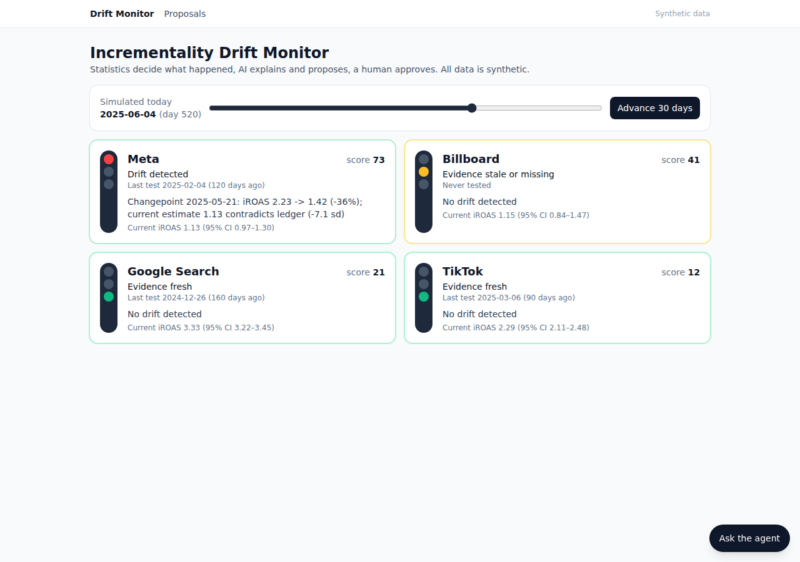
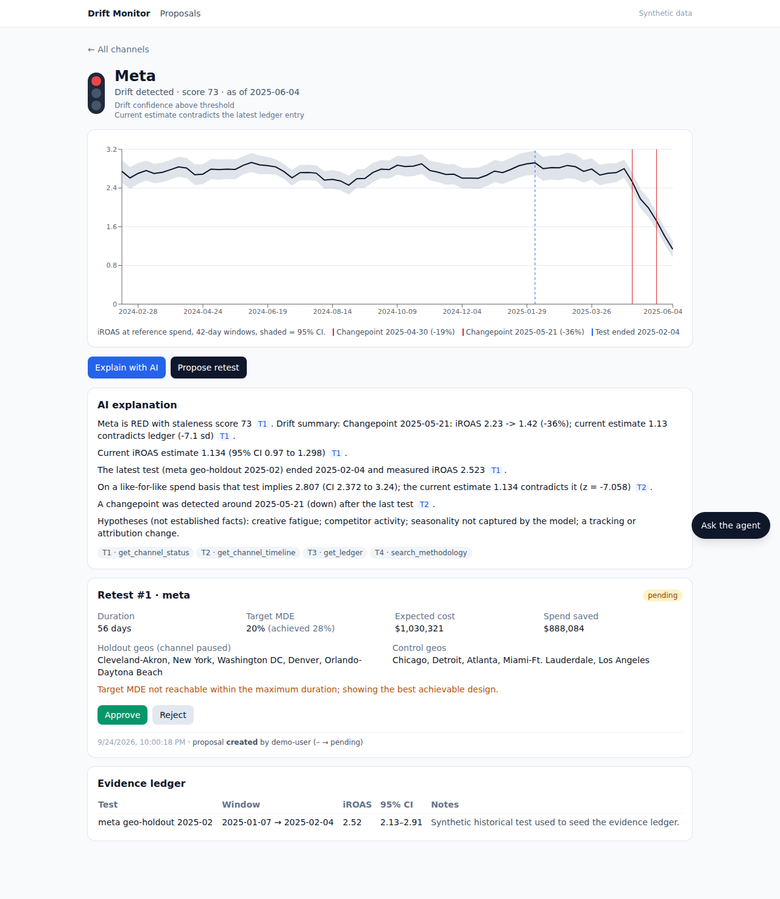

# incrementality-drift-monitor

**Your incrementality test result has an expiry date. Nobody tells you when it passes. This does.**

> All data in this repository is **synthetic**, generated with drift planted on purpose so the
> demo can show detection against a known truth.

**The problem.** A team runs a geo-holdout test on Meta, gets "iROAS 2.5", and budgets on that
number for months. Meanwhile creative fatigues, a competitor moves, tracking changes. The
spend-to-sales relationship drifts and the old test quietly stops being true.

**Why it matters.** Budget keeps flowing on stale evidence. Retests get scheduled by calendar
or gut feeling, too late for channels that broke and too often for channels that didn't.

**What this does.** It keeps an evidence ledger per channel, watches daily spend and outcomes,
and turns each channel into a traffic light. When evidence goes stale it explains why in plain
English and proposes a retest with geos, duration and cost. A human approves.



**Run the demo** (Docker, [uv](https://docs.astral.sh/uv/) and Node 20+):

```bash
git clone https://github.com/Shelunagori/incrementality-drift-monitor && cd incrementality-drift-monitor
make install
make demo        # then open http://localhost:3000
```

`make demo` starts Postgres, seeds the synthetic data, starts the API and the UI, and prints
the story. It uses Ollama (`llama3.1:8b`) if it is running, otherwise an offline template model.

---

## The principle

[**Statistics decide what happened, AI explains and proposes, a human approves.**](docs/INTERVIEW_NOTES.md#statistics-decide-ai-explains-human-approves)

| Layer | Does | Never does |
|---|---|---|
| Statistics (`backend/app/stats/`) | Changepoints, CUSUM, confidence intervals, power, cost | Guess |
| AI agent (`backend/app/agent/`) | Explains tool outputs, drafts proposals | State a number not in a tool output (a guardrail rejects it) |
| Human | Approves or rejects | — |

Execution is idempotent (exactly once, even under concurrent approvals) and every state change
is written to an audit trail.

## Architecture



One FastAPI backend, one Postgres (with pgvector for the agent's document search), one Next.js
frontend. More detail: [docs/ARCHITECTURE.md](docs/ARCHITECTURE.md).

## Why this matters for a company like Paramark

A measurement company's product is **trustworthy evidence**. An incrementality test is the
gold standard, but it is a snapshot. The moment it is published it starts to age, and today
nobody tells the customer when to retest.

- **Evidence goes stale.** The lift a test measured holds for the conditions during the test.
  Creative, competition, seasonality and tracking all move afterwards.
- **Nobody tells you when to retest.** Teams retest on a calendar, or after a bad quarter. Both
  are expensive: one wastes holdout budget on channels that are fine, the other keeps spending
  on channels that broke weeks ago.
- **This does.** It compares every day of new data with the last test, raises a flag only when
  the statistics say the evidence no longer holds, and turns that flag into a costed retest
  proposal a human can approve in one click. The measurement stays continuous and the
  expensive experiments happen where they are needed.

## What you see in the demo

| Dashboard after the drift | Channel page: explain + propose |
|---|---|
|  |  |

1. **Day 460**: Meta, Google Search and TikTok are green; Billboard is yellow (never tested).
2. **Advance 30 days twice**: Meta turns red. Its effectiveness was cut by 60% on day 480 in the
   synthetic data; the monitor flags it about 20 days later.
3. **Explain with AI**: a plain-English explanation where every number carries a chip pointing
   to the tool output it came from. Possible causes are labelled as hypotheses.
4. **Propose retest**: matched holdout and control geos, duration from a power calculation,
   minimum detectable effect, expected cost.
5. **Approve**: scheduled exactly once, with an audit trail.

Script for presenting it: [docs/DEMO_SCRIPT.md](docs/DEMO_SCRIPT.md).

## How the statistics work (short version)

- **Response model**: every 7 days, a regression on the trailing 42 days of per-geo data
  estimates each channel's incremental ROAS with a confidence interval. Day and geo effects
  absorb seasonality and market size.
- **Drift**: three independent detectors — PELT changepoints, CUSUM, and a direct test of
  today's estimate against the ledger's interval — combine into one confidence score.
- **Status**: RED on confident drift or a significant contradiction with the ledger; YELLOW on
  old or missing evidence or a weak signal; otherwise GREEN.
- **Retest**: pairs of similar geos, a power calculation for duration, expected lost
  conversions for cost.

Full detail and limitations: [docs/METHODOLOGY.md](docs/METHODOLOGY.md).

## LLM providers

One env var switches the model (`.env`, see `.env.example`):

| `LLM_PROVIDER` | Model setting | Key |
|---|---|---|
| `ollama` (default) | `OLLAMA_MODEL=llama3.1:8b` | – |
| `anthropic` | `ANTHROPIC_MODEL` | `ANTHROPIC_API_KEY` |
| `gemini` | `GEMINI_MODEL` | `GOOGLE_API_KEY` |
| `openai` | `OPENAI_MODEL` | `OPENAI_API_KEY` |
| `fake` | offline template writer | – |

`EMBEDDING_PROVIDER` takes the same values (`anthropic` uses Voyage AI with `VOYAGE_API_KEY`,
since Anthropic has no embeddings API). A missing key fails with a message naming the variable.

## Tests

```bash
make test        # backend pytest (needs `make db`) + frontend vitest
make lint        # ruff + eslint + tsc
```

What the suite proves, among other things:

- Meta turns RED within 30 days of the planted drift; TikTok is flagged after its change;
  Google Search and Billboard never turn RED. With the drift removed, nothing turns RED.
- The engine never sees data after its as-of day.
- Approval executes exactly once, including four concurrent approvals; reject never executes.
- An answer with an invented number is rejected and retried; injected instructions in a
  ledger note cannot make the agent draft a proposal.

The LLM is replaced by deterministic fakes, so no model is needed. CI runs both suites on every
push.

## Repository

```
backend/   FastAPI app, stats engine, agent, Alembic migrations, data generator, tests
frontend/  Next.js 14 dashboard (Tailwind, recharts), vitest tests
docs/      methodology, architecture, decisions, limitations, roadmap, interview notes
infra/     Postgres init SQL, demo script
```

| Doc | What's in it |
|---|---|
| [METHODOLOGY](docs/METHODOLOGY.md) | Every statistical method in plain English, with limits |
| [ARCHITECTURE](docs/ARCHITECTURE.md) | Components, data model, trust boundaries |
| [DECISIONS](docs/DECISIONS.md) | Choices made where the brief was open |
| [LIMITATIONS](docs/LIMITATIONS.md) | What this POC does not do |

Other make targets: `make dev`, `make seed`, `make help`. License: MIT.
