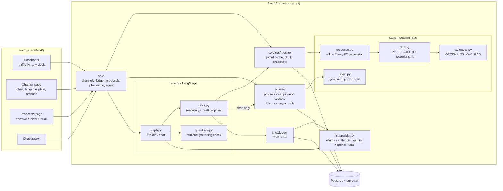

# Architecture

One FastAPI backend, one Postgres (with pgvector), one Next.js frontend. No queues, no Redis.

## Flow of one question: "is my Meta evidence still good?"

1. `GET /channels` → `monitor.assessments()` returns the snapshot for the simulated day, or
   runs the engine: data up to that day → rolling estimates → drift detectors → status.
2. The engine result is stored as a `channel_snapshots` row (JSON) so repeat reads are cheap.
3. `POST /agent/explain` → the agent calls read-only tools that return **the same engine
   outputs**, the LLM writes prose, and `guardrails.check_answer` verifies every number
   against the tool outputs it cites (one retry, then a template fallback).
4. `POST /proposals/retest` (UI) or the agent's `draft_retest_proposal` tool → `retest.py`
   designs a plan → a **pending** `proposals` row + audit event. Nothing runs.
5. `POST /proposals/{id}/approve` (a human) → row lock → one `scheduled_tests` row (unique on
   `proposal_id`) → audit events. A second approve is a no-op; reject never executes.

## Trust boundaries

| Component | May compute numbers | May write |
|---|---|---|
| `stats/` | yes (only place) | no |
| agent + LLM | no (checked) | pending proposals only, policy-gated in code |
| human via UI/API | – | approve / reject, ledger entries |

## Data model

`channels`, `geos`, `daily_metrics` (spend), `daily_conversions`, `evidence_ledger`,
`sim_clock`, `channel_snapshots`, `proposals`, `scheduled_tests`, `audit_events`,
`knowledge_chunks` (pgvector). Migrations: `backend/alembic/versions/`.
